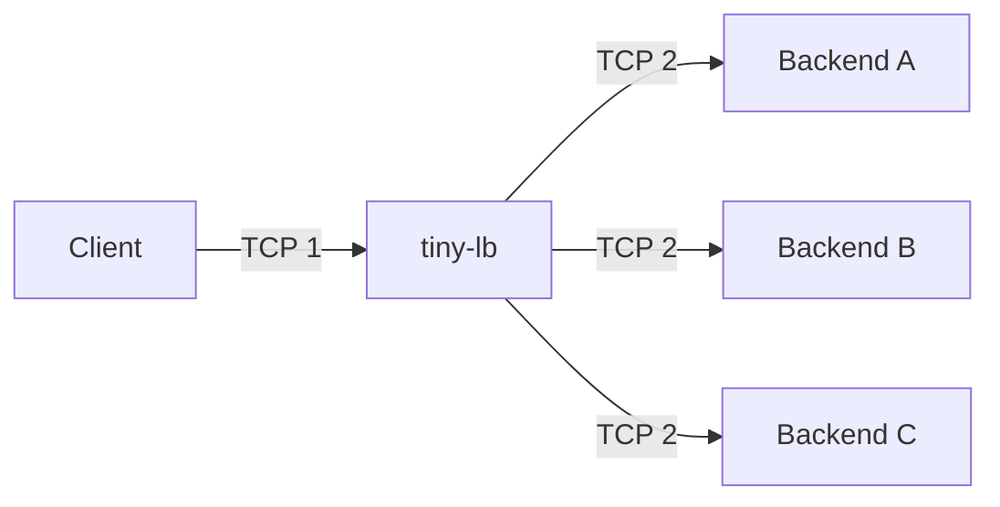

# tiny-lb

A Layer-4 TCP load balancer: it accepts a client connection, opens a **second** TCP connection to a backend (round-robin), and copies bytes. It does not forward packets.

```mermaid
flowchart LR
  C[Client] -->|TCP 1| LB[tiny-lb]
  LB -->|TCP 2| A[Backend A]
  LB -->|TCP 2| B[Backend B]
  LB -->|TCP 2| C2[Backend C]
```
